# AetherTrack Database Entity Relationship Model Guide (Presentation Edition)

## 1) Purpose of This Guide
This guide is designed for presentation use. It explains how the core MongoDB collections relate to each other, what those relationships mean for business workflows, and how to narrate the data model clearly to technical and non-technical stakeholders.

## 2) One-Slide Executive Summary
AetherTrack uses a domain-driven MongoDB schema centered around `User`, `Task`, `Project`, `Team`, `Attendance`, and `Leave` entities. Most business records are tied to a tenant key (`workspaceId`) to support multi-workspace segregation. The model supports:

- Work management: projects, sprints, tasks, comments
- People and org structure: users, teams, settings
- HR operations: attendance, leave, shifts, verification controls
- Governance and traceability: audit logs, change logs, notifications

## 3) Presenter Talking Points
Use these in sequence for a 5-10 minute walkthrough:

1. Start with the identity spine: `User` is referenced by almost every functional area.
2. Explain work planning flow: `Project -> Sprint -> Task -> Comment`.
3. Explain HR flow: `User -> Attendance` and `User -> LeaveRequest -> LeaveType`.
4. Explain shift logic: `ShiftPolicy`, `ShiftRotationRule`, `EmployeeShiftAssignment` feed attendance behavior.
5. Close with controls: `VerificationSettings`, `GeofenceLocation`, `AttendanceAudit`, `ChangeLog`.

## 4) Core Entity Domains

### 4.1 Identity and Organization
- `User`
- `Team`
- `UserSettings`
- `WorkspaceSettings`

### 4.2 Work Management
- `Project`
- `Sprint`
- `Task`
- `Comment`
- `TaskReallocationLog`

### 4.3 HR and Attendance
- `Attendance`
- `AttendanceAudit`
- `LeaveRequest`
- `LeaveType`
- `LeaveBalance`
- `Shift`
- `ShiftPolicy`
- `ShiftRotationRule`
- `EmployeeShiftAssignment`
- `Meeting`

### 4.4 Communication and Governance
- `Notification`
- `EmailTemplate`
- `ChangeLog`
- `VerificationSettings`
- `GeofenceLocation`

## 5) Relationship Matrix (Presentation View)

| Source | Relationship | Target | Cardinality | Why it matters |
|---|---|---|---|---|
| User | belongs to primary team | Team | many-to-one (`team_id`) | Main reporting line |
| User | belongs to multiple teams | Team | many-to-many (`teams[]`, `Team.members[]`) | Cross-functional assignments |
| Team | has lead | User | many-to-one (`lead_id`) | Team accountability |
| Team | has HR owner | User | many-to-one (`hr_id`) | Operational ownership |
| Project | created by | User | many-to-one (`created_by`) | Project ownership |
| Project | has members | User | many-to-many (`team_members[].user`) | Delivery collaboration |
| Sprint | belongs to project | Project | many-to-one (`project`) | Time-boxed project execution |
| Task | belongs to project | Project | many-to-one (`project_id`) | Project decomposition |
| Task | belongs to sprint | Sprint | many-to-one (`sprint_id`) | Sprint backlog mapping |
| Task | assigned to users | User | many-to-many (`assigned_to[]`) | Shared task responsibility |
| Task | linked to team | Team | many-to-one (`team_id`) | Team-level workload |
| Task | created by | User | many-to-one (`created_by`) | Traceable creation |
| Task | self-references parent | Task | hierarchical (`parent_id`) | WBS/subtask structure |
| Task | depends on predecessor | Task | many-to-many (`dependencies[].predecessor_id`) | Scheduling critical path |
| Comment | belongs to task | Task | many-to-one (`task_id`) | Discussion thread |
| Comment | authored by | User | many-to-one (`author_id`) | Accountability |
| Attendance | belongs to user | User | many-to-one (`userId`) | Daily attendance record |
| Attendance | optionally links shift | Shift | many-to-one (`shift_id`) | Shift-aware calculations |
| Attendance | optionally links project | Project | many-to-one (`projectId`) | Time context |
| AttendanceAudit | belongs to attendance | Attendance | many-to-one (`attendanceId`) | Verifiable attendance actions |
| AttendanceAudit | acted by user | User | many-to-one (`performedBy`) | Audit accountability |
| LeaveRequest | requested by | User | many-to-one (`userId`) | Leave lifecycle |
| LeaveRequest | of leave type | LeaveType | many-to-one (`leaveTypeId`) | Policy categorization |
| LeaveRequest | approved by | User | many-to-one (`approvedBy`) | Approver traceability |
| LeaveBalance | belongs to user | User | many-to-one (`userId`) | Yearly leave accounting |
| LeaveBalance | for leave type | LeaveType | many-to-one (`leaveTypeId`) | Type-specific quota |
| ShiftPolicy | created by | User | many-to-one (`created_by`) | Policy control |
| ShiftPolicy | includes slots | Shift | one-to-many (`shift_slots[].shift_id`) | Active shift model |
| ShiftRotationRule | created by | User | many-to-one (`created_by`) | Rotation governance |
| ShiftRotationRule | covers users | User | many-to-many (`user_ids[]`) | Rotating workforce |
| ShiftRotationRule | sequence uses shifts | Shift | one-to-many (`shift_sequence[].shift_id`) | Rotation cycle |
| EmployeeShiftAssignment | assigns user | User | many-to-one (`user_id`) | Effective shift assignment |
| EmployeeShiftAssignment | assigns shift | Shift | many-to-one (`shift_id`) | Operational shift mapping |
| EmployeeShiftAssignment | optional rotation rule | ShiftRotationRule | many-to-one (`rotation_rule_id`) | Rule-driven assignments |
| Notification | belongs to user | User | many-to-one (`user_id`) | In-app communication |
| Notification | optional task context | Task | many-to-one (`task_id`) | Contextual alerts |
| TaskReallocationLog | references task | Task | many-to-one (`taskId`) | Leave/absence continuity |
| TaskReallocationLog | references original user | User | many-to-one (`originalUserId`) | Reallocation source |
| TaskReallocationLog | references reallocated user | User | many-to-one (`reallocatedToUserId`) | Reallocation destination |
| TaskReallocationLog | optional redistributed user | User | many-to-one (`redistributedToUserId`) | Final assignee trace |
| GeofenceLocation | created by | User | many-to-one (`createdBy`) | Geofence ownership |
| VerificationSettings | created/updated by | User | many-to-one (`createdBy`, `updatedBy`) | Compliance governance |
| Meeting | created by | User | many-to-one (`created_by`) | Scheduling ownership |
| Meeting | participants users | User | many-to-many (`participant_users[]`) | Attendance target |
| Meeting | participants teams | Team | many-to-many (`participant_teams[]`) | Group-level invites |
| Meeting | recurring parent | Meeting | self-reference (`parent_meeting_id`) | Recurrence support |
| ChangeLog | actor user | User | many-to-one (`user_id`) | System-wide audit trail |
| UserSettings | settings for user | User | one-to-one (`user_id`, unique) | Per-user preferences |

## 6) ER Diagram (Mermaid)
Use this directly in Markdown renderers that support Mermaid.

```mermaid
erDiagram
    USER ||--o{ TEAM : leads
    USER ||--o{ TEAM : hr_owner
    USER }o--o{ TEAM : member_of

    USER ||--o{ PROJECT : creates
    USER }o--o{ PROJECT : project_member

    PROJECT ||--o{ SPRINT : contains
    PROJECT ||--o{ TASK : contains
    SPRINT  ||--o{ TASK : schedules

    USER ||--o{ TASK : creates
    USER }o--o{ TASK : assigned_to
    TEAM ||--o{ TASK : owns

    TASK ||--o{ COMMENT : has
    USER ||--o{ COMMENT : writes

    USER ||--o{ ATTENDANCE : has
    SHIFT ||--o{ ATTENDANCE : contextualizes
    PROJECT ||--o{ ATTENDANCE : optional_context

    ATTENDANCE ||--o{ ATTENDANCE_AUDIT : audited_by
    USER ||--o{ ATTENDANCE_AUDIT : performs

    USER ||--o{ LEAVE_REQUEST : requests
    LEAVE_TYPE ||--o{ LEAVE_REQUEST : categorizes
    USER ||--o{ LEAVE_REQUEST : approves

    USER ||--o{ LEAVE_BALANCE : owns
    LEAVE_TYPE ||--o{ LEAVE_BALANCE : quota_type

    USER ||--o{ SHIFT_POLICY : creates
    SHIFT_POLICY ||--o{ SHIFT : references_slot

    USER ||--o{ SHIFT_ROTATION_RULE : creates
    USER }o--o{ SHIFT_ROTATION_RULE : included_user
    SHIFT_ROTATION_RULE ||--o{ SHIFT : sequence_slot

    USER ||--o{ EMPLOYEE_SHIFT_ASSIGNMENT : assigned
    SHIFT ||--o{ EMPLOYEE_SHIFT_ASSIGNMENT : assignment_shift
    SHIFT_ROTATION_RULE ||--o{ EMPLOYEE_SHIFT_ASSIGNMENT : optional_rule

    USER ||--o{ NOTIFICATION : receives
    TASK ||--o{ NOTIFICATION : optional_context

    TASK ||--o{ TASK_REALLOCATION_LOG : tracked
    USER ||--o{ TASK_REALLOCATION_LOG : original_user
    USER ||--o{ TASK_REALLOCATION_LOG : reallocated_to
    USER ||--o{ TASK_REALLOCATION_LOG : redistributed_to

    USER ||--o{ USER_SETTINGS : owns
    USER ||--o{ CHANGE_LOG : acts

    USER ||--o{ GEOFENCE_LOCATION : creates
    USER ||--o{ VERIFICATION_SETTINGS : governs

    USER ||--o{ MEETING : creates
    USER }o--o{ MEETING : participant
    TEAM }o--o{ MEETING : participant_team
    MEETING ||--o{ MEETING : recurrence_parent
```

## 7) How to Present This in 6 Slides

1. Slide 1: System context
- Explain that MongoDB collections model people, work, and HR operations.
- Mention tenant segmentation via `workspaceId` where applicable.

2. Slide 2: Identity + organization domain
- Highlight `User`, `Team`, `UserSettings`, `WorkspaceSettings`.
- Emphasize role-based access implications.

3. Slide 3: Work management domain
- Walk through `Project -> Sprint -> Task -> Comment`.
- Mention task hierarchy and dependency links.

4. Slide 4: Attendance and leave domain
- Explain `Attendance`, `AttendanceAudit`, `LeaveRequest`, `LeaveBalance`, `LeaveType`.
- Show compliance and traceability paths.

5. Slide 5: Shift and verification controls
- Explain how `ShiftPolicy`, `ShiftRotationRule`, and `EmployeeShiftAssignment` influence attendance.
- Add `GeofenceLocation` and `VerificationSettings` as anti-fraud controls.

6. Slide 6: Governance and operational reliability
- Summarize `ChangeLog`, `Notification`, and `TaskReallocationLog`.
- Conclude with observability and audit-readiness.

## 8) Notes and Caveats (Important for Q&A)
- The codebase uses mixed naming conventions (snake_case and camelCase), e.g., `team_id` vs `userId`.
- Several schemas reference a logical `Workspace` via `workspaceId`, but there is no standalone `Workspace` model file in the current backend models directory.
- Some older docs may show legacy enum values; presentation should be based on model files in `backend/models`.

## 9) Optional Closing Statement for Stakeholders
The ER model is intentionally modular: user identity powers both project delivery and HR workflows, while audit and verification layers ensure enterprise-grade traceability and compliance without coupling operational domains too tightly.
