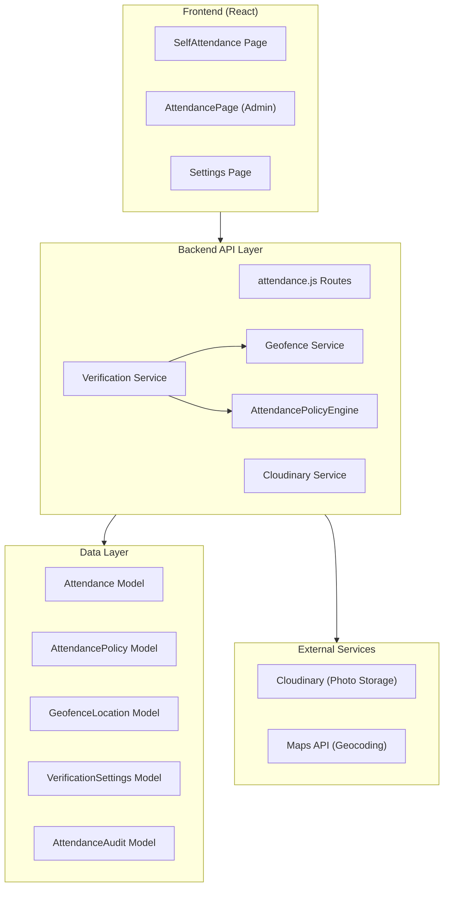
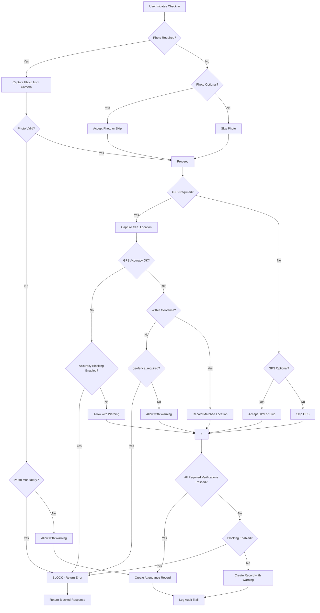

# Enterprise Attendance Tracking with Photo & GPS Verification

## Architectural Design Document

**Version:** 1.0  
**Date:** 2026-03-02  
**Author:** AetherTrackSAAS Architecture Team

---

## 1. Executive Summary

This document outlines a comprehensive enterprise-grade attendance tracking system with photo and GPS verification. The feature extends the existing AetherTrackSAAS attendance module with enhanced security, geofencing capabilities, and verification workflows while maintaining backward compatibility with existing functionality.

### 1.1 Design Goals

1. **Verification Independence** - Photo and GPS verification can be independently enabled/disabled
2. **Flexible Enforcement** - Each verification method can be mandatory or optional
3. **Security First** - Prevent photo reuse, enforce permissions, detect tampering
4. **Admin Control** - Comprehensive settings, review workflows, and audit trails
5. **User Experience** - Minimal friction for legitimate check-ins with clear feedback

---

## 2. Feature Architecture

### 2.1 System Architecture Diagram



### 2.2 Component Responsibilities

| Component | Responsibility |
|-----------|----------------|
| SelfAttendance Page | Photo capture, GPS location, display verification requirements |
| AttendancePage (Admin) | Review attendance with photo/map, approve/reject overrides |
| Settings Page | Configure verification settings, manage geofences |
| Verification Service | Validate photos and GPS, enforce policy rules |
| Geofence Service | Check GPS coordinates against allowed locations |
| AttendanceAudit | Log all verification events for audit trail |

---

## 3. Data Schema Design

### 3.1 New Models Required

#### 3.1.1 VerificationSettings Model

```javascript
// backend/models/VerificationSettings.js
import mongoose from 'mongoose';

const verificationSettingsSchema = new mongoose.Schema({
  // Organization/Workspace level settings
  workspace_id: {
    type: mongoose.Schema.Types.ObjectId,
    ref: 'Workspace',
    required: true,
    index: true
  },

  // Photo Verification Configuration
  photo_verification: {
    enabled: {
      type: Boolean,
      default: false
    },
    // true = mandatory, false = optional
    is_mandatory: {
      type: Boolean,
      default: false
    },
    // Block attendance if photo fails validation
    block_on_failure: {
      type: Boolean,
      default: true
    },
    // Store latest photo URL for display
    current_photo_url: {
      type: String,
      default: null
    }
  },

  // GPS Verification Configuration
  gps_verification: {
    enabled: {
      type: Boolean,
      default: false
    },
    is_mandatory: {
      type: Boolean,
      default: false
    },
    block_on_failure: {
      type: Boolean,
      default: true
    },
    // Minimum GPS accuracy in meters
    accuracy_threshold_meters: {
      type: Number,
      default: 100,
      min: 0,
      max: 1000
    },
    // Require GPS to be within geofence
    require_geofence: {
      type: Boolean,
      default: true
    }
  },

  // Work Mode Specific Rules
  work_mode_rules: {
    // For WFH, GPS may be optional
    wfh: {
      photo_required: {
        type: Boolean,
        default: false
      },
      gps_required: {
        type: Boolean,
        default: false
      }
    },
    // For onsite, both may be required
    onsite: {
      photo_required: {
        type: Boolean,
        default: true
      },
      gps_required: {
        type: Boolean,
        default: true
      }
    },
    // Hybrid can have custom rules
    hybrid: {
      photo_required: {
        type: Boolean,
        default: false
      },
      gps_required: {
        type: Boolean,
        default: false
      }
    }
  },

  // Security Settings
  security: {
    // Prevent reuse of old photos
    prevent_photo_reuse: {
      type: Boolean,
      default: true
    },
    // Minimum time between same photo detection (seconds)
    photo_reuse_window_seconds: {
      type: Number,
      default: 3600
    },
    // Capture device metadata
    capture_device_info: {
      type: Boolean,
      default: true
    },
    // Enable tamper detection
    enable_tamper_detection: {
      type: Boolean,
      default: true
    }
  },

  // Admin who last updated settings
  updated_by: {
    type: mongoose.Schema.Types.ObjectId,
    ref: 'User',
    default: null
  },

  // Settings version for caching
  version: {
    type: Number,
    default: 1
  }
}, {
  timestamps: { createdAt: 'created_at', updatedAt: 'updated_at' }
});

// Singleton pattern - one settings per workspace
verificationSettingsSchema.statics.getOrCreate = async function(workspace_id) {
  let settings = await this.findOne({ workspace_id });
  if (!settings) {
    settings = await this.create({ workspace_id });
  }
  return settings;
};

const VerificationSettings = mongoose.model('VerificationSettings', verificationSettingsSchema);
export default VerificationSettings;
```

#### 3.1.2 GeofenceLocation Model

```javascript
// backend/models/GeofenceLocation.js
import mongoose from 'mongoose';

const geofenceLocationSchema = new mongoose.Schema({
  workspace_id: {
    type: mongoose.Schema.Types.ObjectId,
    ref: 'Workspace',
    required: true,
    index: true
  },

  name: {
    type: String,
    required: true,
    trim: true,
    maxlength: 100
  },

  description: {
    type: String,
    default: '',
    maxlength: 500
  },

  // Location coordinates
  coordinates: {
    latitude: {
      type: Number,
      required: true,
      min: -90,
      max: 90
    },
    longitude: {
      type: Number,
      required: true,
      min: -180,
      max: 180
    }
  },

  // Radius in meters
  radius_meters: {
    type: Number,
    default: 100,
    min: 10,
    max: 5000
  },

  // Location type
  location_type: {
    type: String,
    enum: ['office', 'branch', 'client_site', 'remote', 'other'],
    default: 'office'
  },

  // Address for display
  address: {
    type: String,
    default: ''
  },

  // Whether this location is active
  is_active: {
    type: Boolean,
    default: true
  },

  // Apply to specific teams (empty = all teams)
  applies_to_teams: [{
    type: mongoose.Schema.Types.ObjectId,
    ref: 'Team'
  }],

  // Apply to specific users (empty = all users)
  applies_to_users: [{
    type: mongoose.Schema.Types.ObjectId,
    ref: 'User'
  }],

  // Work modes allowed at this location
  allowed_work_modes: [{
    type: String,
    enum: ['onsite', 'wfh', 'hybrid']
  }],

  // Operating hours (optional)
  operating_hours: {
    start: {
      type: String, // HH:MM format
      default: '09:00'
    },
    end: {
      type: String, // HH:MM format
      default: '18:00'
    },
    timezone: {
      type: String,
      default: 'Asia/Kolkata'
    }
  },

  // Created by
  created_by: {
    type: mongoose.Schema.Types.ObjectId,
    ref: 'User',
    required: true
  }
}, {
  timestamps: { createdAt: 'created_at', updatedAt: 'updated_at' }
});

// Index for geospatial queries
geofenceLocationSchema.index({ 
  workspace_id: 1, 
  coordinates: '2dsphere',
  is_active: 1 
});

/**
 * Check if coordinates are within this geofence
 */
geofenceLocationSchema.methods.containsPoint = function(lat, lng) {
  const R = 6371000; // Earth's radius in meters
  const lat1 = this.coordinates.latitude * Math.PI / 180;
  const lat2 = lat * Math.PI / 180;
  const deltaLat = (lat - this.coordinates.latitude) * Math.PI / 180;
  const deltaLng = (lng - this.coordinates.longitude) * Math.PI / 180;

  const a = Math.sin(deltaLat / 2) * Math.sin(deltaLat / 2) +
            Math.cos(lat1) * Math.cos(lat2) *
            Math.sin(deltaLng / 2) * Math.sin(deltaLng / 2);
  const c = 2 * Math.atan2(Math.sqrt(a), Math.sqrt(1 - a));
  const distance = R * c;

  return distance <= this.radius_meters;
};

/**
 * Find all active geofences containing a point
 */
geofenceLocationSchema.statics.findContainingPoint = async function(workspace_id, lat, lng) {
  return this.find({
    workspace_id,
    is_active: true,
    coordinates: {
      $near: {
        $geometry: {
          type: 'Point',
          coordinates: [lng, lat]
        },
        $maxDistance: 5000 // Search within 5km
      }
    }
  });
};

const GeofenceLocation = mongoose.model('GeofenceLocation', geofenceLocationSchema);
export default GeofenceLocation;
```

#### 3.1.3 AttendanceAudit Model

```javascript
// backend/models/AttendanceAudit.js
import mongoose from 'mongoose';

const attendanceAuditSchema = new mongoose.Schema({
  // Reference to attendance record
  attendance_id: {
    type: mongoose.Schema.Types.ObjectId,
    ref: 'Attendance',
    index: true
  },

  // User who performed the action
  user_id: {
    type: mongoose.Schema.Types.ObjectId,
    ref: 'User',
    required: true,
    index: true
  },

  // Action type
  action: {
    type: String,
    enum: [
      'CHECKIN_VERIFICATION',
      'CHECKOUT_VERIFICATION',
      'PHOTO_CAPTURED',
      'PHOTO_VALIDATED',
      'PHOTO_REJECTED',
      'GPS_CAPTURED',
      'GPS_VALIDATED',
      'GPS_REJECTED',
      'GEOFENCE_MATCHED',
      'GEOFENCE_MISMATCH',
      'VERIFICATION_BLOCKED',
      'VERIFICATION_SKIPPED',
      'OVERRIDE_APPROVED',
      'OVERRIDE_REJECTED',
      'ATTENDANCE_APPROVED',
      'ATTENDANCE_REJECTED',
      'ADMIN_OVERRIDE',
      'DEVICE_INFO_CAPTURED',
      'TAMPER_DETECTED'
    ],
    required: true
  },

  // Verification details
  verification: {
    // Photo verification
    photo: {
      url: String,
      validated: Boolean,
      rejection_reason: String,
      capture_timestamp: Date
    },
    // GPS verification
    gps: {
      latitude: Number,
      longitude: Number,
      accuracy: Number,
      timestamp: Date,
      validated: Boolean,
      rejection_reason: String,
      matched_location: String
    },
    // Geofence results
    geofence: {
      location_id: mongoose.Schema.Types.ObjectId,
      location_name: String,
      within_radius: Boolean,
      distance_meters: Number
    }
  },

  // Device information
  device_info: {
    user_agent: String,
    device_type: String,
    browser: String,
    platform: String,
    ip_address: String
  },

  // Server timestamp (authoritative)
  server_timestamp: {
    type: Date,
    default: Date.now
  },

  // Request metadata
  request: {
    endpoint: String,
    method: String,
    headers: Object,
    body_hash: String // Hash of request body for integrity
  },

  // Result
  result: {
    success: Boolean,
    message: String,
    blocked: Boolean
  },

  // Admin override details (if applicable)
  override: {
    override_by: {
      type: mongoose.Schema.Types.ObjectId,
      ref: 'User'
    },
    override_reason: String,
    original_values: Object,
    new_values: Object
  },

  // Remarks
  remarks: {
    type: String,
    maxlength: 1000
  }
}, {
  timestamps: { createdAt: 'created_at', updatedAt: 'updated_at' }
});

// Compound indexes
attendanceAuditSchema.index({ user_id: 1, created_at: -1 });
attendanceAuditSchema.index({ attendance_id: 1, created_at: -1 });
attendanceAuditSchema.index({ action: 1, created_at: -1 });
attendanceAuditSchema.index({ 'verification.gps.validated': 1 });
attendanceAuditSchema.index({ 'verification.photo.validated': 1 });

const AttendanceAudit = mongoose.model('AttendanceAudit', attendanceAuditSchema);
export default AttendanceAudit;
```

### 3.2 Updated Attendance Model

```javascript
// Additions to existing Attendance model (backend/models/Attendance.js)

// New verification section after existing fields
verification: {
  // Photo verification
  photo: {
    url: {
      type: String,
      default: null
    },
    public_id: {
      type: String,
      default: null // Cloudinary public ID
    },
    captured_at: {
      type: Date,
      default: null
    },
    validated: {
      type: Boolean,
      default: null
    },
    validation_message: {
      type: String,
      default: null
    }
  },

  // GPS verification
  gps: {
    latitude: {
      type: Number,
      default: null
    },
    longitude: {
      type: Number,
      default: null
    },
    accuracy: {
      type: Number,
      default: null // in meters
    },
    timestamp: {
      type: Date,
      default: null
    },
    validated: {
      type: Boolean,
      default: null
    },
    validation_message: {
      type: String,
      default: null
    },
    // Reference to matched geofence
    matched_location_id: {
      type: mongoose.Schema.Types.ObjectId,
      ref: 'GeofenceLocation',
      default: null
    },
    matched_location_name: {
      type: String,
      default: null
    },
    distance_meters: {
      type: Number,
      default: null
    }
  },

  // Verification status summary
  status: {
    type: String,
    enum: [
      'PENDING',
      'VERIFIED',
      'PHOTO_FAILED',
      'GPS_FAILED',
      'GEOFENCE_MISMATCH',
      'BLOCKED',
      'SKIPPED'
    ],
    default: 'PENDING'
  },

  // Verification requirements at time of check-in
  requirements: {
    photo_required: {
      type: Boolean,
      default: false
    },
    gps_required: {
      type: Boolean,
      default: false
    },
    geofence_required: {
      type: Boolean,
      default: false
    }
  }
},

// Device metadata captured at check-in
device_info: {
  user_agent: {
    type: String,
    default: null
  },
  device_type: {
    type: String,
    default: null
  },
  ip_address: {
    type: String,
    default: null
  }
},

// Admin review status
admin_review: {
  status: {
    type: String,
    enum: ['PENDING', 'APPROVED', 'REJECTED', 'OVERRIDE'],
    default: 'PENDING'
  },
  reviewed_by: {
    type: mongoose.Schema.Types.ObjectId,
    ref: 'User',
    default: null
  },
  reviewed_at: {
    type: Date,
    default: null
  },
  review_remarks: {
    type: String,
    default: null
  }
}
```

### 3.3 Updated AttendancePolicy Model

```javascript
// Additions to existing AttendancePolicy model

// New verification rules section
verification_rules: {
  // Photo verification rules
  photo: {
    enabled: {
      type: Boolean,
      default: false
    },
    is_mandatory: {
      type: Boolean,
      default: false
    },
    block_on_failure: {
      type: Boolean,
      default: true
    }
  },

  // GPS verification rules
  gps: {
    enabled: {
      type: Boolean,
      default: false
    },
    is_mandatory: {
      type: Boolean,
      default: false
    },
    block_on_failure: {
      type: Boolean,
      default: true
    },
    accuracy_threshold_meters: {
      type: Number,
      default: 100
    }
  },

  // Geofence rules
  geofence: {
    enabled: {
      type: Boolean,
      default: false
    },
    // Use workspace default geofences or specify custom
    use_default_locations: {
      type: Boolean,
      default: true
    },
    // Specific location IDs if not using defaults
    allowed_locations: [{
      type: mongoose.Schema.Types.ObjectId,
      ref: 'GeofenceLocation'
    }]
  }
}
```

---

## 4. API Endpoint Design

### 4.1 Verification Configuration Endpoints

#### GET /api/hr/attendance/verification-settings
Get current verification settings for the workspace.

**Response:**
```json
{
  "success": true,
  "settings": {
    "photo_verification": {
      "enabled": true,
      "is_mandatory": true,
      "block_on_failure": true
    },
    "gps_verification": {
      "enabled": true,
      "is_mandatory": false,
      "block_on_failure": false,
      "accuracy_threshold_meters": 100,
      "require_geofence": true
    },
    "work_mode_rules": {
      "wfh": { "photo_required": false, "gps_required": false },
      "onsite": { "photo_required": true, "gps_required": true },
      "hybrid": { "photo_required": false, "gps_required": false }
    },
    "security": {
      "prevent_photo_reuse": true,
      "capture_device_info": true,
      "enable_tamper_detection": true
    }
  }
}
```

#### PUT /api/hr/attendance/verification-settings
Update verification settings (Admin only).

**Request:**
```json
{
  "photo_verification": {
    "enabled": true,
    "is_mandatory": true,
    "block_on_failure": true
  },
  "gps_verification": {
    "enabled": true,
    "is_mandatory": false,
    "accuracy_threshold_meters": 50
  }
}
```

### 4.2 Geofence Management Endpoints

#### GET /api/hr/attendance/geofences
List all geofence locations.

**Query Params:**
- `active_only` (boolean) - Filter to active locations only
- `location_type` (string) - Filter by type

#### POST /api/hr/attendance/geofences
Create a new geofence location (Admin only).

**Request:**
```json
{
  "name": "Head Office",
  "description": "Main corporate office",
  "coordinates": {
    "latitude": 19.0760,
    "longitude": 72.8777
  },
  "radius_meters": 150,
  "location_type": "office",
  "address": "Mumbai, Maharashtra, India",
  "allowed_work_modes": ["onsite", "hybrid"],
  "operating_hours": {
    "start": "09:00",
    "end": "18:00"
  }
}
```

#### PUT /api/hr/attendance/geofences/:id
Update a geofence location (Admin only).

#### DELETE /api/hr/attendance/geofences/:id
Delete (soft delete) a geofence location (Admin only).

#### GET /api/hr/attendance/geofences/nearest
Find nearest geofence to coordinates.

**Query Params:**
- `latitude` (required)
- `longitude` (required)

### 4.3 Check-in/Check-out with Verification

#### POST /api/hr/attendance/checkin
Enhanced check-in with photo and GPS verification.

**Request:**
```json
{
  "date": "2026-03-02",
  "workMode": "onsite",
  "reason": "",
  "photo": {
    "data": "base64_encoded_image_data",
    "timestamp": "2026-03-02T09:30:00.000Z"
  },
  "gps": {
    "latitude": 19.0760,
    "longitude": 72.8777,
    "accuracy": 10,
    "timestamp": "2026-03-02T09:30:00.000Z"
  },
  "device_info": {
    "user_agent": "Mozilla/5.0...",
    "device_type": "mobile"
  }
}
```

**Response (Success):**
```json
{
  "success": true,
  "attendance": { /* attendance record */ },
  "verification": {
    "photo": {
      "validated": true,
      "url": "cloudinary_url"
    },
    "gps": {
      "validated": true,
      "matched_location_name": "Head Office",
      "distance_meters": 25
    },
    "status": "VERIFIED"
  },
  "evaluation": { /* policy evaluation */ }
}
```

**Response (Blocked):**
```json
{
  "success": false,
  "blocked": true,
  "reason": "GPS verification failed",
  "details": {
    "gps": {
      "validated": false,
      "reason": "Not within any allowed location"
    }
  }
}
```

### 4.4 Photo Upload Endpoints

#### POST /api/hr/attendance/photo/upload
Upload photo for verification (handles base64 or multipart).

**Request (Multipart):**
- `photo`: Image file (will be rejected if from gallery)
- `timestamp`: Capture timestamp
- `device_id`: Device identifier

**Security Checks:**
1. Validate image is from live camera (not gallery)
2. Check for tampering indicators
3. Validate file type and size
4. Check for photo reuse

#### DELETE /api/hr/attendance/photo/:publicId
Delete a previously uploaded photo (Admin only).

### 4.5 Admin Review Endpoints

#### GET /api/hr/attendance/pending-review
Get all attendance records pending review.

**Query Params:**
- `start_date`
- `end_date`
- `status` (PENDING, APPROVED, REJECTED)
- `user_id`

#### POST /api/hr/attendance/:id/approve
Approve an attendance record (Admin).

**Request:**
```json
{
  "remarks": "Verified and approved"
}
```

#### POST /api/hr/attendance/:id/reject
Reject an attendance record (Admin).

**Request:**
```json
{
  "reason": "Photo verification failed - unclear image",
  "require_new_verification": true
}
```

#### POST /api/hr/attendance/:id/override
Override verification requirements (Admin).

**Request:**
```json
{
  "reason": "Employee was at client site with no GPS",
  "new_values": {
    "gps": {
      "latitude": 19.1234,
      "longitude": 72.9876,
      "validated": true,
      "matched_location_name": "Client Site - Approved"
    }
  }
}
```

### 4.6 Audit Endpoints

#### GET /api/hr/attendance/audit
Get audit logs for attendance verifications.

**Query Params:**
- `attendance_id`
- `user_id`
- `action`
- `start_date`
- `end_date`
- `page`, `limit`

---

## 5. Validation Logic Flow

### 5.1 Check-in Verification Flow



### 5.2 GPS Validation Logic

```javascript
// backend/services/verificationService.js

class VerificationService {
  
  /**
   * Validate GPS coordinates
   */
  static async validateGPS(gpsData, settings) {
    const errors = [];
    const warnings = [];
    
    // 1. Check accuracy threshold
    if (gpsData.accuracy > settings.gps_verification.accuracy_threshold_meters) {
      if (settings.gps_verification.block_on_failure) {
        errors.push({
          type: 'GPS_ACCURACY',
          message: `GPS accuracy ${gpsData.accuracy}m exceeds threshold ${settings.gps_verification.accuracy_threshold_meters}m`
        });
      } else {
        warnings.push({
          type: 'GPS_ACCURACY',
          message: `GPS accuracy ${gpsData.accuracy}m is below optimal threshold`
        });
      }
    }
    
    // 2. Check timestamp freshness (within 5 minutes)
    const now = new Date();
    const gpsTime = new Date(gpsData.timestamp);
    const timeDiff = Math.abs(now - gpsTime) / (1000 * 60); // minutes
    
    if (timeDiff > 5) {
      warnings.push({
        type: 'GPS_TIMESTAMP',
        message: 'GPS location captured more than 5 minutes ago'
      });
    }
    
    // 3. Validate against geofences if required
    let geofenceResult = null;
    if (settings.gps_verification.require_geofence) {
      geofenceResult = await this.validateGeofence(gpsData);
      
      if (!geofenceResult.within_geofence) {
        if (settings.gps_verification.block_on_failure) {
          errors.push({
            type: 'GEOFENCE_MISMATCH',
            message: 'Not within any allowed location',
            details: geofenceResult
          });
        } else {
          warnings.push({
            type: 'GEOFENCE_MISMATCH',
            message: 'Outside allowed locations',
            details: geofenceResult
          });
        }
      }
    }
    
    return {
      validated: errors.length === 0,
      errors,
      warnings,
      geofenceResult
    };
  }
  
  /**
   * Validate GPS against geofences
   */
  static async validateGeofence(gpsData) {
    const { latitude, longitude } = gpsData;
    
    // Find geofences containing this point
    const matchingLocations = await GeofenceLocation.findContainingPoint(
      getCurrentWorkspaceId(),
      latitude,
      longitude
    );
    
    if (matchingLocations.length === 0) {
      return {
        within_geofence: false,
        matched_location_id: null,
        matched_location_name: null,
        distance_meters: null,
        available_locations: []
      };
    }
    
    // Find the closest matching location
    let closestLocation = null;
    let shortestDistance = Infinity;
    
    for (const location of matchingLocations) {
      const distance = this.calculateDistance(
        latitude, longitude,
        location.coordinates.latitude,
        location.coordinates.longitude
      );
      
      if (distance < shortestDistance) {
        shortestDistance = distance;
        closestLocation = location;
      }
    }
    
    return {
      within_geofence: true,
      matched_location_id: closestLocation._id,
      matched_location_name: closestLocation.name,
      distance_meters: Math.round(shortestDistance),
      matched_location: closestLocation
    };
  }
  
  /**
   * Calculate distance between two points (Haversine formula)
   */
  static calculateDistance(lat1, lng1, lat2, lng2) {
    const R = 6371000; // Earth's radius in meters
    const dLat = (lat2 - lat1) * Math.PI / 180;
    const dLng = (lng2 - lng1) * Math.PI / 180;
    const a = Math.sin(dLat / 2) * Math.sin(dLat / 2) +
              Math.cos(lat1 * Math.PI / 180) * Math.cos(lat2 * Math.PI / 180) *
              Math.sin(dLng / 2) * Math.sin(dLng / 2);
    const c = 2 * Math.atan2(Math.sqrt(a), Math.sqrt(1 - a));
    return R * c;
  }
}
```

### 5.3 Photo Validation Logic

```javascript
// backend/services/verificationService.js (continued)

class VerificationService {
  
  /**
   * Validate photo
   */
  static async validatePhoto(photoData, userId, settings) {
    const errors = [];
    const warnings = [];
    
    // 1. Check photo exists
    if (!photoData.data) {
      if (settings.photo_verification.is_mandatory) {
        errors.push({
          type: 'PHOTO_MISSING',
          message: 'Photo is required for check-in'
        });
      }
      return {
        validated: false,
        errors,
        warnings,
        photo_url: null
      };
    }
    
    // 2. Upload photo to Cloudinary
    const uploadResult = await this.uploadPhoto(photoData.data, userId);
    
    // 3. Validate photo properties
    const validationResult = await this.analyzePhoto(uploadResult.url);
    
    if (!validationResult.is_valid) {
      if (settings.photo_verification.block_on_failure) {
        errors.push({
          type: 'PHOTO_INVALID',
          message: validationResult.reason
        });
      } else {
        warnings.push({
          type: 'PHOTO_INVALID',
          message: validationResult.reason
        });
      }
    }
    
    // 4. Check for photo reuse
    const reuseCheck = await this.checkPhotoReuse(uploadResult.public_id, userId);
    if (reuseCheck.is_reused) {
      errors.push({
        type: 'PHOTO_REUSE',
        message: 'Duplicate photo detected'
      });
    }
    
    // 5. Check for tampering
    if (settings.security.enable_tamper_detection) {
      const tamperCheck = await this.checkTampering(uploadResult.url);
      if (tamperCheck.is_tampered) {
        warnings.push({
          type: 'PHOTO_TAMPERED',
          message: 'Photo may have been modified'
        });
      }
    }
    
    return {
      validated: errors.length === 0,
      errors,
      warnings,
      photo_url: uploadResult.url,
      photo_public_id: uploadResult.public_id
    };
  }
  
  /**
   * Upload photo to Cloudinary with security settings
   */
  static async uploadPhoto(base64Data, userId) {
    // Remove data URL prefix if present
    const base64Image = base64Data.replace(/^data:image\/\w+;base64,/, '');
    const imageBuffer = Buffer.from(base64Image, 'base64');
    
    const result = await cloudinary.uploader.upload_stream(
      {
        folder: 'aethertrack/attendance/photos',
        resource_type: 'image',
        public_id: `${userId}_${Date.now()}`,
        transformation: [
          { width: 800, height: 600, crop: 'limit' },
          { quality: 'auto:good' },
          { fetch_format: 'webp' }
        ],
        // Add metadata for security
        context: {
          user_id: userId,
          captured_at: new Date().toISOString()
        }
      },
      (error, result) => {
        if (error) throw error;
        return result;
      }
    );
    
    return {
      url: result.secure_url,
      public_id: result.public_id
    };
  }
  
  /**
   * Check for photo reuse
   */
  static async checkPhotoReuse(publicId, userId) {
    // Check if this exact photo was used recently
    const recentPhoto = await Attendance.findOne({
      'verification.photo.public_id': publicId,
      userId: userId,
      createdAt: {
        $gte: new Date(Date.now() - settings.security.photo_reuse_window_seconds * 1000)
      }
    });
    
    return {
      is_reused: !!recentPhoto
    };
  }
}
```

---

## 6. Frontend Component Design

### 6.1 SelfAttendance Page Enhancements

```jsx
// frontend/src/pages/SelfAttendance.jsx (Enhanced)

// New state for verification
const [verificationSettings, setVerificationSettings] = useState(null);
const [photoRequired, setPhotoRequired] = useState(false);
const [gpsRequired, setGpsRequired] = useState(false);
const [capturedPhoto, setCapturedPhoto] = useState(null);
const [gpsLocation, setGpsLocation] = useState(null);
const [verificationStatus, setVerificationStatus] = useState(null);

// Camera ref for photo capture
const videoRef = useRef(null);
const canvasRef = useRef(null);
const [cameraActive, setCameraActive] = useState(false);

// Fetch verification settings on mount
useEffect(() => {
  fetchVerificationSettings();
}, []);

const fetchVerificationSettings = async () => {
  try {
    const response = await api.get('/hr/attendance/verification-settings');
    setVerificationSettings(response.data.settings);
    
    // Determine requirements based on work mode
    const rules = response.data.settings.work_mode_rules;
    const workModeRules = rules[workMode] || rules.onsite;
    setPhotoRequired(workModeRules.photo_required);
    setGpsRequired(workModeRules.gps_required);
  } catch (error) {
    console.error('Error fetching verification settings:', error);
  }
};

// Photo capture functions
const startCamera = async () => {
  try {
    const stream = await navigator.mediaDevices.getUserMedia({
      video: { 
        facingMode: 'user', // Front camera
        width: { ideal: 1280 },
        height: { ideal: 720 }
      }
    });
    videoRef.current.srcObject = stream;
    setCameraActive(true);
  } catch (error) {
    console.error('Error accessing camera:', error);
    setError('Unable to access camera. Please check permissions.');
  }
};

const capturePhoto = () => {
  const canvas = canvasRef.current;
  const video = videoRef.current;
  
  canvas.width = video.videoWidth;
  canvas.height = video.videoHeight;
  
  const context = canvas.getContext('2d');
  context.drawImage(video, 0, 0);
  
  const imageData = canvas.toDataURL('image/jpeg', 0.8);
  setCapturedPhoto({
    data: imageData,
    timestamp: new Date().toISOString()
  });
  
  stopCamera();
};

const stopCamera = () => {
  if (videoRef.current?.srcObject) {
    const tracks = videoRef.current.srcObject.getTracks();
    tracks.forEach(track => track.stop());
    videoRef.current.srcObject = null;
  }
  setCameraActive(false);
};

// GPS capture functions
const captureGPS = () => {
  if (!navigator.geolocation) {
    setError('Geolocation is not supported by your browser');
    return;
  }
  
  navigator.geolocation.getCurrentPosition(
    (position) => {
      setGpsLocation({
        latitude: position.coords.latitude,
        longitude: position.coords.longitude,
        accuracy: position.coords.accuracy,
        timestamp: new Date().toISOString()
      });
    },
    (error) => {
      console.error('GPS error:', error);
      setError('Unable to get location. Please check GPS permissions.');
    },
    {
      enableHighAccuracy: true,
      timeout: 10000,
      maximumAge: 0
    }
  );
};

// Enhanced check-in handler
const handleCheckIn = async () => {
  // Collect device info
  const deviceInfo = {
    user_agent: navigator.userAgent,
    device_type: /Mobi|Android/i.test(navigator.userAgent) ? 'mobile' : 'desktop'
  };
  
  try {
    const response = await api.post('/hr/attendance/checkin', {
      workMode,
      reason,
      date: new Date().toISOString().split('T')[0],
      photo: capturedPhoto,
      gps: gpsLocation,
      device_info: deviceInfo
    });
    
    if (response.data.success) {
      setSuccess(response.data.message);
      setVerificationStatus(response.data.verification);
      fetchTodayAttendance();
    }
  } catch (error) {
    if (error.response?.data?.blocked) {
      setError(error.response.data.reason);
      setVerificationStatus(error.response.data.details);
    } else {
      setError(error.response?.data?.message || 'Check-in failed');
    }
  }
};
```

### 6.2 Photo Capture Component

```jsx
// frontend/src/components/PhotoCapture.jsx

import { useState, useRef, useEffect } from 'react';
import { Camera, RefreshCw, X, AlertCircle } from 'lucide-react';

export default function PhotoCapture({ 
  onCapture, 
  required = false, 
  disabled = false 
}) {
  const videoRef = useRef(null);
  const canvasRef = useRef(null);
  const [isActive, setIsActive] = useState(false);
  const [capturedImage, setCapturedImage] = useState(null);
  const [error, setError] = useState(null);
  const [permissionDenied, setPermissionDenied] = useState(false);

  const startCamera = async () => {
    try {
      setError(null);
      const stream = await navigator.mediaDevices.getUserMedia({
        video: {
          facingMode: 'user',
          width: { ideal: 1280 },
          height: { ideal: 720 }
        }
      });
      videoRef.current.srcObject = stream;
      setIsActive(true);
    } catch (err) {
      console.error('Camera error:', err);
      if (err.name === 'NotAllowedError') {
        setPermissionDenied(true);
        setError('Camera permission denied. Please allow camera access.');
      } else {
        setError('Unable to access camera');
      }
    }
  };

  const stopCamera = () => {
    if (videoRef.current?.srcObject) {
      videoRef.current.srcObject.getTracks().forEach(track => track.stop());
    }
    setIsActive(false);
  };

  const capture = () => {
    const canvas = canvasRef.current;
    const video = videoRef.current;
    
    if (!canvas || !video) return;
    
    canvas.width = video.videoWidth;
    canvas.height = video.videoHeight;
    
    const ctx = canvas.getContext('2d');
    ctx.drawImage(video, 0, 0);
    
    // Mirror the image for front camera
    ctx.translate(canvas.width, 0);
    ctx.scale(-1, 1);
    ctx.drawImage(video, 0, 0);
    
    const imageData = canvas.toDataURL('image/jpeg', 0.85);
    setCapturedImage(imageData);
    
    onCapture({
      data: imageData,
      timestamp: new Date().toISOString()
    });
    
    stopCamera();
  };

  const retake = () => {
    setCapturedImage(null);
    startCamera();
  };

  // Cleanup on unmount
  useEffect(() => {
    return () => {
      if (videoRef.current?.srcObject) {
        videoRef.current.srcObject.getTracks().forEach(track => track.stop());
      }
    };
  }, []);

  return (
    <div className="photo-capture-container">
      {!capturedImage ? (
        <div className="capture-area">
          {isActive ? (
            <>
              <video 
                ref={videoRef} 
                autoPlay 
                playsInline 
                className="camera-preview"
              />
              <div className="camera-controls">
                <button onClick={capture} className="capture-btn">
                  <Camera size={24} />
                  Capture
                </button>
                <button onClick={stopCamera} className="cancel-btn">
                  <X size={24} />
                  Cancel
                </button>
              </div>
            </>
          ) : (
            <div className="capture-prompt">
              {permissionDenied ? (
                <div className="permission-error">
                  <AlertCircle size={48} />
                  <p>{error}</p>
                  <button onClick={startCamera} className="retry-btn">
                    <RefreshCw size={16} />
                    Try Again
                  </button>
                </div>
              ) : (
                <>
                  <Camera size={48} />
                  <p>{required ? 'Photo is required' : 'Capture a photo (optional)'}</p>
                  <button onClick={startCamera} className="start-cam-btn">
                    Open Camera
                  </button>
                </>
              )}
            </div>
          )}
        </div>
      ) : (
        <div className="captured-preview">
          
          <button onClick={retake} className="retake-btn">
            <RefreshCw size={16} />
            Retake
          </button>
        </div>
      )}
      
      <canvas ref={canvasRef} style={{ display: 'none' }} />
    </div>
  );
}
```

### 6.3 GPS Location Component

```jsx
// frontend/src/components/LocationCapture.jsx

import { useState, useEffect } from 'react';
import { MapPin, Navigation, AlertCircle, Loader } from 'lucide-react';

export default function LocationCapture({ 
  onCapture, 
  required = false,
  accuracyThreshold = 100,
  disabled = false 
}) {
  const [status, setStatus] = useState('idle'); // idle, loading, success, error
  const [location, setLocation] = useState(null);
  const [error, setError] = useState(null);
  const [watching, setWatching] = useState(false);

  const getLocation = () => {
    if (!navigator.geolocation) {
      setError('Geolocation is not supported');
      setStatus('error');
      return;
    }

    setStatus('loading');
    setError(null);

    navigator.geolocation.getCurrentPosition(
      (position) => {
        const loc = {
          latitude: position.coords.latitude,
          longitude: position.coords.longitude,
          accuracy: position.coords.accuracy,
          timestamp: new Date().toISOString()
        };
        
        setLocation(loc);
        onCapture(loc);
        
        if (position.coords.accuracy > accuracyThreshold) {
          setStatus('warning');
          setError(`Low accuracy: ${Math.round(position.coords.accuracy)}m (threshold: ${accuracyThreshold}m)`);
        } else {
          setStatus('success');
        }
      },
      (err) => {
        setStatus('error');
        switch (err.code) {
          case err.PERMISSION_DENIED:
            setError('Location permission denied');
            break;
          case err.POSITION_UNAVAILABLE:
            setError('Location information unavailable');
            break;
          case err.TIMEOUT:
            setError('Location request timed out');
            break;
          default:
            setError('Failed to get location');
        }
      },
      {
        enableHighAccuracy: true,
        timeout: 15000,
        maximumAge: 0
      }
    );
  };

  const getCurrentLocation = () => {
    setWatching(true);
    getLocation();
  };

  return (
    <div className="location-capture-container">
      <div className="location-display">
        {location ? (
          <div className="location-info">
            <MapPin size={20} />
            <div className="coordinates">
              <span>Lat: {location.latitude.toFixed(6)}</span>
              <span>Lng: {location.longitude.toFixed(6)}</span>
            </div>
            <span className={`accuracy ${location.accuracy > accuracyThreshold ? 'warning' : 'good'}`}>
              Accuracy: {Math.round(location.accuracy)}m
            </span>
          </div>
        ) : (
          <div className="no-location">
            <MapPin size={20} />
            <span>{required ? 'Location required' : 'No location captured'}</span>
          </div>
        )}
      </div>

      {error && (
        <div className={`error-message ${status === 'warning' ? 'warning' : 'error'}`}>
          <AlertCircle size={16} />
          {error}
        </div>
      )}

      <button 
        onClick={getCurrentLocation} 
        disabled={disabled || status === 'loading'}
        className={`get-location-btn ${status}`}
      >
        {status === 'loading' ? (
          <>
            <Loader size={16} className="spin" />
            Getting location...
          </>
        ) : (
          <>
            <Navigation size={16} />
            {location ? 'Update Location' : 'Get Location'}
          </>
        )}
      </button>
    </div>
  );
}
```

### 6.4 Admin Verification Settings Component

```jsx
// frontend/src/pages/admin/VerificationSettings.jsx

import { useState, useEffect } from 'react';
import { Save, RefreshCw, MapPin, Camera, Shield } from 'lucide-react';
import api from '../../api/axios';

export default function VerificationSettings() {
  const [settings, setSettings] = useState({
    photo_verification: { enabled: false, is_mandatory: false, block_on_failure: true },
    gps_verification: { enabled: false, is_mandatory: false, block_on_failure: true, accuracy_threshold_meters: 100 },
    work_mode_rules: {
      onsite: { photo_required: true, gps_required: true },
      wfh: { photo_required: false, gps_required: false },
      hybrid: { photo_required: false, gps_required: false }
    },
    security: { prevent_photo_reuse: true, capture_device_info: true, enable_tamper_detection: true }
  });
  const [loading, setLoading] = useState(true);
  const [saving, setSaving] = useState(false);
  const [message, setMessage] = useState(null);

  useEffect(() => {
    fetchSettings();
  }, []);

  const fetchSettings = async () => {
    try {
      const response = await api.get('/hr/attendance/verification-settings');
      setSettings(response.data.settings);
    } catch (error) {
      console.error('Error fetching settings:', error);
    } finally {
      setLoading(false);
    }
  };

  const saveSettings = async () => {
    setSaving(true);
    try {
      await api.put('/hr/attendance/verification-settings', settings);
      setMessage({ type: 'success', text: 'Settings saved successfully' });
    } catch (error) {
      setMessage({ type: 'error', text: 'Failed to save settings' });
    } finally {
      setSaving(false);
    }
  };

  if (loading) return <div>Loading...</div>;

  return (
    <div className="verification-settings">
      <h2>Attendance Verification Settings</h2>
      
      {/* Photo Verification Section */}
      <section className="settings-section">
        <div className="section-header">
          <Camera size={24} />
          <h3>Photo Verification</h3>
        </div>
        
        <div className="settings-grid">
          <label className="toggle-setting">
            <input
              type="checkbox"
              checked={settings.photo_verification.enabled}
              onChange={(e) => setSettings({
                ...settings,
                photo_verification: { ...settings.photo_verification, enabled: e.target.checked }
              })}
            />
            <span>Enable Photo Verification</span>
          </label>
          
          <label className="toggle-setting">
            <input
              type="checkbox"
              checked={settings.photo_verification.is_mandatory}
              onChange={(e) => setSettings({
                ...settings,
                photo_verification: { ...settings.photo_verification, is_mandatory: e.target.checked }
              })}
            />
            <span>Mandatory for Check-in</span>
          </label>
          
          <label className="toggle-setting">
            <input
              type="checkbox"
              checked={settings.photo_verification.block_on_failure}
              onChange={(e) => setSettings({
                ...settings,
                photo_verification: { ...settings.photo_verification, block_on_failure: e.target.checked }
              })}
            />
            <span>Block Attendance on Failure</span>
          </label>
        </div>
      </section>

      {/* GPS Verification Section */}
      <section className="settings-section">
        <div className="section-header">
          <MapPin size={24} />
          <h3>GPS Verification</h3>
        </div>
        
        <div className="settings-grid">
          <label className="toggle-setting">
            <input
              type="checkbox"
              checked={settings.gps_verification.enabled}
              onChange={(e) => setSettings({
                ...settings,
                gps_verification: { ...settings.gps_verification, enabled: e.target.checked }
              })}
            />
            <span>Enable GPS Verification</span>
          </label>
          
          <label className="toggle-setting">
            <input
              type="checkbox"
              checked={settings.gps_verification.is_mandatory}
              onChange={(e) => setSettings({
                ...settings,
                gps_verification: { ...settings.gps_verification, is_mandatory: e.target.checked }
              })}
            />
            <span>Mandatory for Check-in</span>
          </label>
          
          <label className="toggle-setting">
            <input
              type="checkbox"
              checked={settings.gps_verification.block_on_failure}
              onChange={(e) => setSettings({
                ...settings,
                gps_verification: { ...settings.gps_verification, block_on_failure: e.target.checked }
              })}
            />
            <span>Block Attendance on Failure</span>
          </label>
          
          <div className="number-setting">
            <label>Accuracy Threshold (meters)</label>
            <input
              type="number"
              value={settings.gps_verification.accuracy_threshold_meters}
              onChange={(e) => setSettings({
                ...settings,
                gps_verification: { 
                  ...settings.gps_verification, 
                  accuracy_threshold_meters: parseInt(e.target.value) 
                }
              })}
              min={0}
              max={1000}
            />
          </div>
        </div>
      </section>

      {/* Security Section */}
      <section className="settings-section">
        <div className="section-header">
          <Shield size={24} />
          <h3>Security Settings</h3>
        </div>
        
        <div className="settings-grid">
          <label className="toggle-setting">
            <input
              type="checkbox"
              checked={settings.security.prevent_photo_reuse}
              onChange={(e) => setSettings({
                ...settings,
                security: { ...settings.security, prevent_photo_reuse: e.target.checked }
              })}
            />
            <span>Prevent Photo Reuse</span>
          </label>
          
          <label className="toggle-setting">
            <input
              type="checkbox"
              checked={settings.security.capture_device_info}
              onChange={(e) => setSettings({
                ...settings,
                security: { ...settings.security, capture_device_info: e.target.checked }
              })}
            />
            <span>Capture Device Information</span>
          </label>
          
          <label className="toggle-setting">
            <input
              type="checkbox"
              checked={settings.security.enable_tamper_detection}
              onChange={(e) => setSettings({
                ...settings,
                security: { ...settings.security, enable_tamper_detection: e.target.checked }
              })}
            />
            <span>Enable Tamper Detection</span>
          </label>
        </div>
      </section>

      {/* Save Button */}
      <div className="actions">
        <button onClick={saveSettings} disabled={saving} className="save-btn">
          {saving ? <RefreshCw className="spin" /> : <Save />}
          {saving ? 'Saving...' : 'Save Settings'}
        </button>
      </div>
    </div>
  );
}
```

### 6.5 Admin Attendance Review Component

```jsx
// frontend/src/components/AttendanceReviewModal.jsx

import { useState, useEffect } from 'react';
import { MapPin, Camera, CheckCircle, XCircle, AlertTriangle, Clock } from 'lucide-react';
import api from '../api/axios';

export default function AttendanceReviewModal({ attendance, onClose, onApprove, onReject }) {
  const [loading, setLoading] = useState(false);
  const [action, setAction] = useState(null);
  const [remarks, setRemarks] = useState('');

  const handleAction = async () => {
    setLoading(true);
    try {
      if (action === 'approve') {
        await api.post(`/hr/attendance/${attendance._id}/approve`, { remarks });
        onApprove();
      } else if (action === 'reject') {
        await api.post(`/hr/attendance/${attendance._id}/reject`, { reason: remarks });
        onReject();
      }
    } catch (error) {
      console.error('Action failed:', error);
    } finally {
      setLoading(false);
    }
  };

  const verification = attendance.verification || {};
  const statusColors = {
    VERIFIED: 'green',
    PENDING: 'yellow',
    PHOTO_FAILED: 'red',
    GPS_FAILED: 'red',
    GEOFENCE_MISMATCH: 'orange',
    BLOCKED: 'red'
  };

  return (
    <div className="review-modal">
      <div className="modal-content">
        <h3>Attendance Review</h3>
        
        {/* User Info */}
        <div className="user-info">
          
          <div>
            <strong>{attendance.userId?.full_name}</strong>
            <span>{attendance.date}</span>
          </div>
        </div>

        {/* Check-in Time */}
        <div className="time-info">
          <Clock size={20} />
          <span>Check-in: {new Date(attendance.checkIn).toLocaleTimeString()}</span>
          {attendance.checkOut && (
            <span>Check-out: {new Date(attendance.checkOut).toLocaleTimeString()}</span>
          )}
        </div>

        {/* Verification Status */}
        <div className="verification-status">
          <h4>Verification Status</h4>
          <div className={`status-badge ${statusColors[verification.status]}`}>
            {verification.status}
          </div>

          {/* Photo */}
          {verification.photo?.url && (
            <div className="verification-item">
              <Camera size={20} />
              <span>Photo:</span>
              
              {verification.photo.validated ? (
                <CheckCircle size={16} className="green" />
              ) : (
                <XCircle size={16} className="red" />
              )}
            </div>
          )}

          {/* GPS */}
          {verification.gps?.latitude && (
            <div className="verification-item">
              <MapPin size={20} />
              <span>Location:</span>
              <span>
                {verification.gps.latitude.toFixed(4)}, {verification.gps.longitude.toFixed(4)}
              </span>
              {verification.gps.matched_location_name && (
                <span className="location-match">
                  Matched: {verification.gps.matched_location_name}
                </span>
              )}
              {verification.gps.validated ? (
                <CheckCircle size={16} className="green" />
              ) : (
                <XCircle size={16} className="red" />
              )}
            </div>
          )}
        </div>

        {/* Action Buttons */}
        <div className="action-buttons">
          {!action ? (
            <>
              <button onClick={() => setAction('approve')} className="approve-btn">
                <CheckCircle /> Approve
              </button>
              <button onClick={() => setAction('reject')} className="reject-btn">
                <XCircle /> Reject
              </button>
            </>
          ) : (
            <>
              <textarea
                placeholder={action === 'approve' ? 'Approval remarks (optional)' : 'Rejection reason (required)'}
                value={remarks}
                onChange={(e) => setRemarks(e.target.value)}
                required={action === 'reject'}
              />
              <button 
                onClick={handleAction} 
                disabled={loading || (action === 'reject' && !remarks)}
                className={action === 'approve' ? 'confirm-approve' : 'confirm-reject'}
              >
                {loading ? 'Processing...' : `Confirm ${action === 'approve' ? 'Approval' : 'Rejection'}`}
              </button>
              <button onClick={() => setAction(null)} className="cancel-btn">
                Cancel
              </button>
            </>
          )}
        </div>

        <button onClick={onClose} className="close-btn">Close</button>
      </div>
    </div>
  );
}
```

---

## 7. Security Considerations

### 7.1 Photo Security

| Security Measure | Implementation |
|------------------|-----------------|
| **Camera Only** | Frontend uses `facingMode: 'user'` and `getUserMedia` - only captures from live camera, no file input |
| **Photo Reuse Prevention** | Store hash of photo with user ID and timestamp, check against recent uploads |
| **Tamper Detection** | Analyze EXIF data, check for inconsistent timestamps |
| **Secure Storage** | Photos stored in Cloudinary with signed URLs, auto-expire after 90 days |
| **Server Timestamp** | Use server-authoritative timestamp for audit, not client-provided |

### 7.2 GPS Security

| Security Measure | Implementation |
|------------------|-----------------|
| **Accuracy Threshold** | Configurable minimum accuracy (default 100m) |
| **Timestamp Validation** | GPS timestamp must be within 5 minutes of server time |
| **Geofence Validation** | Only accept GPS within defined locations |
| **Device Consistency** | Cross-check with IP-based geolocation when possible |

### 7.3 API Security

| Security Measure | Implementation |
|------------------|-----------------|
| **Authentication** | All endpoints require valid JWT token |
| **Role Authorization** | Admin-only endpoints check for admin/HR role |
| **Request Signing** | Hash request body for integrity verification |
| **Rate Limiting** | Limit check-in attempts to prevent abuse |
| **Audit Logging** | Log all verification attempts and admin actions |

### 7.4 Device Information Capture

```javascript
// Capture comprehensive device information
const captureDeviceInfo = (req) => {
  return {
    user_agent: req.headers['user-agent'],
    device_type: /Mobi|Android/i.test(req.headers['user-agent']) ? 'mobile' : 'desktop',
    browser: extractBrowser(req.headers['user-agent']),
    platform: extractPlatform(req.headers['user-agent']),
    ip_address: getClientIP(req),
    accept_language: req.headers['accept-language'],
    referer: req.headers['referer']
  };
};
```

---

## 8. Implementation Checklist

### Backend Implementation

- [ ] Create VerificationSettings model
- [ ] Create GeofenceLocation model with geospatial indexes
- [ ] Create AttendanceAudit model
- [ ] Update Attendance model with verification fields
- [ ] Update AttendancePolicy model with verification rules
- [ ] Create VerificationService class
- [ ] Create GeofenceService class
- [ ] Add verification endpoints to attendance routes
- [ ] Add geofence management endpoints
- [ ] Add admin review endpoints
- [ ] Add audit log endpoints
- [ ] Update Cloudinary configuration for photo uploads

### Frontend Implementation

- [ ] Update SelfAttendance page with photo capture
- [ ] Update SelfAttendance page with GPS capture
- [ ] Create PhotoCapture component
- [ ] Create LocationCapture component
- [ ] Create VerificationSettings admin page
- [ ] Create GeofenceMap admin component
- [ ] Create AttendanceReviewModal component
- [ ] Update AttendancePage with verification indicators
- [ ] Add verification status display

### Integration Testing

- [ ] Test photo capture flow
- [ ] Test GPS capture flow
- [ ] Test geofence validation
- [ ] Test admin approval workflow
- [ ] Test audit log retrieval
- [ ] Test verification blocking

---

## 9. Appendix

### A. GPS Accuracy Reference

| Accuracy (m) | Quality | Typical Use Case |
|--------------|---------|------------------|
| < 10 | Excellent | Indoor/urban |
| 10-50 | Good | Most mobile devices |
| 50-100 | Moderate | Older devices |
| 100-500 | Poor | Network-based |
| > 500 | Very Poor | Last resort |

### B. Geofence Radius Guidelines

| Radius | Use Case |
|--------|----------|
| 50m | Single floor building |
| 100m | Small office building |
| 150m | Large office campus |
| 300m | Multi-building complex |
| 500m+ | Large industrial area |

### C. Error Codes

| Code | Description |
|------|-------------|
| GPS_ACCURACY_LOW | GPS accuracy below threshold |
| GPS_NOT_WITHIN_GEOFENCE | Location outside allowed areas |
| PHOTO_REUSE_DETECTED | Duplicate photo detected |
| PHOTO_TAMPERED | Photo may be modified |
| PHOTO_CAMERA_ONLY | Gallery photos not allowed |
| VERIFICATION_REQUIRED | Mandatory verification missing |
| TIMESTAMP_EXPIRED | Verification data too old |

---

*Document Version: 1.0*  
*Last Updated: 2026-03-02*
